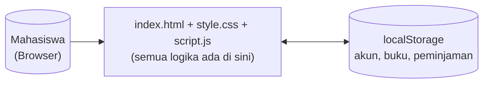
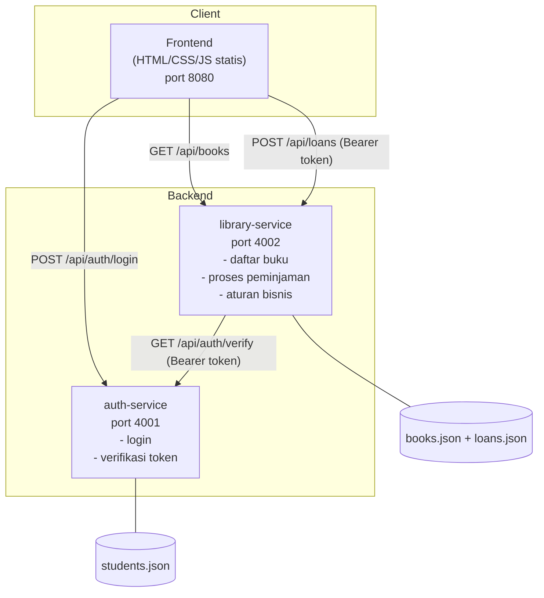

# Architecture — Sebelum vs Sesudah

## 1. Arsitektur Sebelum (Praktikum 2)

Aplikasi berupa **monolith frontend** murni. Tidak ada backend maupun API. Semua logika
(validasi login, aturan peminjaman, penyimpanan data) berjalan di satu file `script.js` di
browser, dan seluruh data (akun mahasiswa, buku, peminjaman) disimpan di `localStorage`
milik browser tersebut.

**Keterbatasan:**
- Data hanya ada di satu browser/perangkat — tidak bisa diakses dari perangkat lain.
- Password mahasiswa tersimpan sebagai teks biasa di kode JavaScript.
- Tidak ada pemisahan tanggung jawab: satu file mengurus login, data buku, dan peminjaman sekaligus.
- Tidak bisa di-scale atau dikembangkan sebagai layanan terpisah.

---

## 2. Arsitektur Sesudah (Microservice)

Aplikasi dipecah menjadi **2 microservice** independen plus 1 frontend statis. Setiap service
punya tanggung jawab dan datanya sendiri, dan berkomunikasi lewat REST API.

### Tanggung Jawab Masing-Masing Service

**auth-service** (port 4001)
- `POST /api/auth/login` — validasi NIM & password, kembalikan JWT token.
- `GET /api/auth/verify` — verifikasi token, dipanggil oleh service lain.
- Memiliki data mahasiswa sendiri (`students.json`), password disimpan dalam bentuk hash (bcrypt).
- Tidak tahu apa pun tentang buku atau peminjaman.

**library-service** (port 4002)
- `GET /api/books` — daftar buku + status ketersediaan (publik, tidak perlu login).
- `GET /api/loans` — daftar peminjaman aktif milik mahasiswa yang sedang login.
- `POST /api/loans` — proses peminjaman buku, menegakkan seluruh aturan bisnis (RB-02 s.d. RB-06).
- `POST /api/system/reset` — reset seluruh data peminjaman (setara fitur "Restart Sistem").
- Memiliki data buku & peminjaman sendiri (`books.json`, `loans.json`).
- Tidak menyimpan password sama sekali. Untuk mengetahui siapa yang sedang login, service ini
  **memanggil auth-service lewat HTTP** (`GET /api/auth/verify`) — inilah bentuk komunikasi
  antar-microservice yang diwajibkan pada ketentuan tugas poin 8.

**frontend** (port 8080)
- Halaman statis yang tidak mengandung logika bisnis apa pun.
- Semua keputusan (apakah boleh pinjam, siapa yang login, dsb.) ditentukan oleh backend,
  frontend hanya menampilkan hasilnya.

### Perbandingan Singkat

| Aspek | Sebelum | Sesudah |
|---|---|---|
| Jumlah komponen backend | 0 | 2 microservice |
| Tempat penyimpanan data | `localStorage` browser | File data per service (dapat diganti database) |
| Password | Teks biasa di kode frontend | Di-hash (bcrypt), hanya ada di auth-service |
| Validasi login | Dilakukan di frontend | Dilakukan di auth-service, dikonfirmasi via API oleh library-service |
| Komunikasi | Tidak ada | REST API (JSON over HTTP) |
| Sesi login | `localStorage` (objek biasa) | JWT (JSON Web Token) dengan masa berlaku |
| Kemungkinan scale terpisah | Tidak mungkin (satu kesatuan) | Bisa — auth-service dan library-service dapat di-deploy dan di-scale terpisah |

---

## 3. Daftar Endpoint API

### auth-service (`http://localhost:4001`)

| Method | Endpoint | Auth | Deskripsi |
|---|---|---|---|
| POST | `/api/auth/login` | - | Login dengan `{ nim, password }`, mengembalikan JWT token |
| GET | `/api/auth/verify` | Bearer token | Memverifikasi token, dipanggil service lain |
| GET | `/api/health` | - | Health check |

### library-service (`http://localhost:4002`)

| Method | Endpoint | Auth | Deskripsi |
|---|---|---|---|
| GET | `/api/books` | - | Daftar buku beserta status (tersedia/dipinjam) |
| GET | `/api/loans` | Bearer token | Daftar peminjaman aktif milik mahasiswa yang login |
| POST | `/api/loans` | Bearer token | Body `{ bookId }`, memproses peminjaman buku |
| POST | `/api/system/reset` | Bearer token | Reset seluruh data peminjaman |
| GET | `/api/health` | - | Health check |
